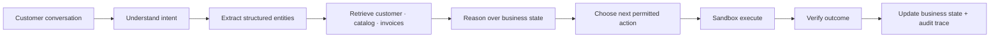
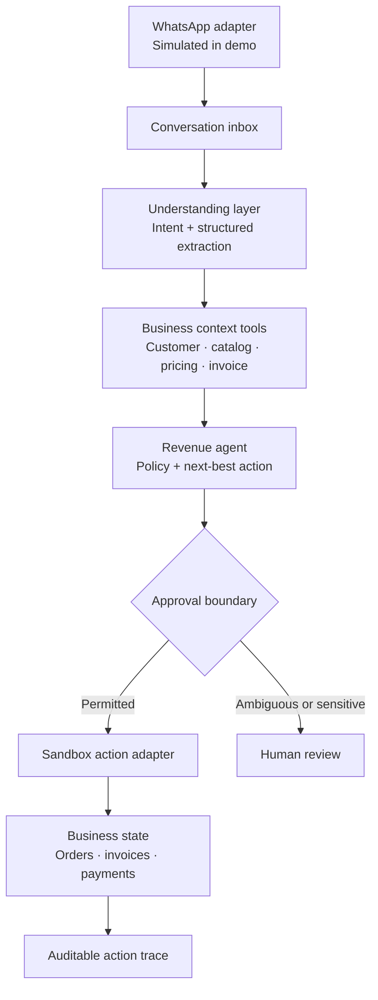
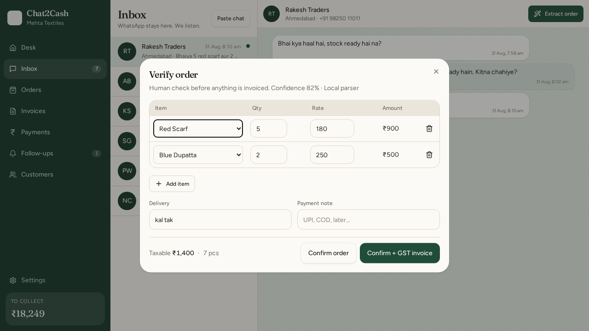
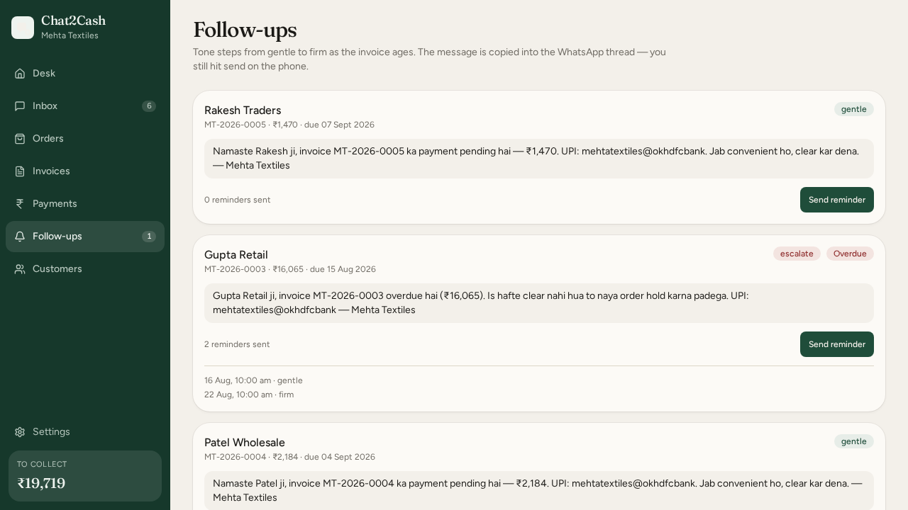

# VYRA

> **The AI revenue agent for WhatsApp-first businesses.**

[](https://vyra-ai-piyush-codexs-projects.vercel.app/demo)
[](https://vyra-ai-piyush-codexs-projects.vercel.app)


VYRA helps Indian SMBs turn the conversations already happening on WhatsApp into orders, invoice drafts, payment state, and the next safe operational action. It is deliberately not a generic chatbot, CRM, or accounting suite: it is a focused revenue-operations agent.

**Live product:** [vyra-ai-piyush-codexs-projects.vercel.app](https://vyra-ai-piyush-codexs-projects.vercel.app) · **Interactive judge flow:** [Demo Studio](https://vyra-ai-piyush-codexs-projects.vercel.app/demo) · **Revenue Recovery:** [Find stuck revenue](https://vyra-ai-piyush-codexs-projects.vercel.app/recovery)

## The problem

For WhatsApp-first businesses, business state is trapped in conversations: a customer order is a loose Hinglish message, a payment promise is buried in a chat, and follow-ups rely on memory. That produces missed orders, manual invoice work, and preventable cash leakage.

## The VYRA loop



| Signal | VYRA response | Boundary |
|---|---|---|
| “5 red scarf aur 2 blue dupatta bhej dena kal tak” | Detects a confirmed order, extracts product lines, resolves context, prepares an invoice draft | Merchant reviews the draft before any real-world change |
| “Price kya hai? Kal tak mil sakta hai?” | Detects an inquiry | No order or invoice is created |
| “Find where my money is stuck” | Prioritizes overdue invoices, retrieves conversation context, drafts a follow-up, simulates delivery | No real WhatsApp, UPI, or financial action |

## Product architecture



The app makes the agent legible: the UI shows tool names, structured results, concise decisions, approval flags, and outcomes. It never exposes chain-of-thought.

## Screens

| Conversation → structured state | Revenue Recovery |
|---|---|
|  |  |

## Demo script — two minutes

1. Open [Demo Studio](https://vyra-ai-piyush-codexs-projects.vercel.app/demo).
2. Click **Confirmed order**, then **Analyze**.
3. Point out the intent, extracted product lines, customer resolution, catalog lookup, and visible agent trace.
4. Click **Prepare invoice draft** to show that VYRA chooses a safe, reviewable action rather than silently performing irreversible work.
5. Open [Revenue Recovery](https://vyra-ai-piyush-codexs-projects.vercel.app/recovery).
6. Click **Find stuck revenue**. Explain the priority reason, contextual reminder, sandbox result, and state update.
7. Return to Demo Studio and choose **Safe inquiry** to demonstrate the human-approval boundary: VYRA does not create an order from an inquiry.

## What is intentionally real in demo mode

- Deterministic Hinglish / English intent classification
- Structured extraction of item, quantity, delivery intent, and confirmation state
- Customer, catalog, pricing, invoice, and outstanding-revenue retrieval
- Prioritized revenue recovery decisions
- Invoice drafts and auditable action events
- Safe simulated messaging and state updates

## What is intentionally not connected

The demo does not require or simulate access to real WhatsApp credentials, financial credentials, Aadhaar, OTPs, CAPTCHA bypass, live UPI collection, or irreversible actions. Those integrations would be explicitly approval-gated in a production rollout.

## Local development

```bash
npm ci
npm run dev
npm run typecheck
npm run build
```

The app persists only browser demo state. Use **Settings → Reset demo** to restore the seed data.

## Project structure

```text
src/routes/_app/demo.tsx       Judge-facing Conversation → Revenue simulation
src/routes/_app/recovery.tsx   Revenue Recovery hero workflow
src/lib/parse-order.ts         Deterministic local Hinglish extraction
src/lib/revenue-agent.ts       Outstanding-revenue prioritization and trace
src/lib/store.ts               Browser-persisted demo business state
public/showcase/               Product hero and presentation-ready UI visuals
```

## Product thesis

**Unstructured conversations → structured orders → invoice → payment tracking → intelligent action → revenue recovery.**

VYRA meets businesses where the work already happens, then turns each conversation into a safe, visible operational decision.
